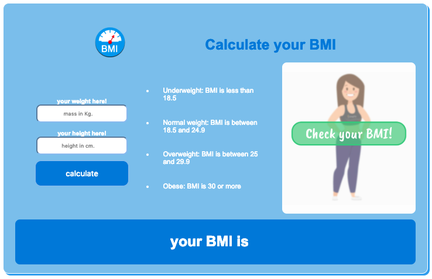

# calculate BMI

> This is the first mini project of javascript tutorial in Integrify!

##Demo

[calculate BMI App](https://mostafain.github.io/BMI-miniProject/bmiIndex.html)

## Screenshot

## Technologies

- HTML
- CSS
- JavaScript

## Status

Project is: _in progress_, _finished_, _no longer continue_ and why?

## Inspiration

Add here credits. Project inspired by..., based on...

## Contact

Created by [mostafa](https://github.mostafaIn.com) - feel free to contact me!
